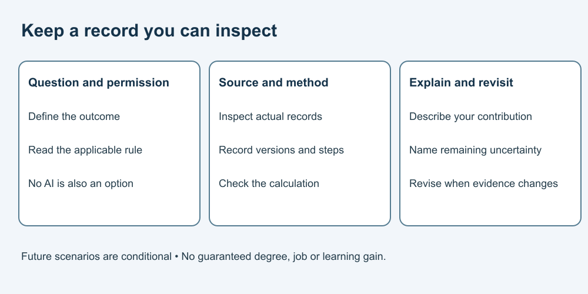

# How to Use AI in College/University

**Learn to use AI well—and remain able to think, choose and act for yourself.**

A complete course for postsecondary learners, primarily adult beginners, about study, research preparation and academic communication. Some students are minors; institutional requirements and individual support needs still apply. This audience guide is not proof of suitability or permission to use any service.

No AI account, installation, paid tool or prerequisite course is needed. Use paper or a local text editor. Every required activity includes its own fictional material and can be completed offline. Familiarity with basic arithmetic helps; worked steps and an educator guide are supplied.

## Start learning

1. [Define the question before asking AI](lessons/01-question.md)
2. [Separate permission from verification](lessons/02-rules.md)
3. [Build a search plan](lessons/03-search.md)
4. [Trace a citation to a record](lessons/04-citations.md)
5. [Compare methods before conclusions](lessons/05-evidence.md)
6. [Write a synthesis you can defend](lessons/06-synthesis.md)
7. [Check a small analysis](lessons/07-data.md)
8. [Leave a method another reader can inspect](lessons/08-method.md)
9. [Protect material and describe contributions](lessons/09-responsibility.md)
10. [Build a workflow and examine future possibilities](lessons/10-workflow.md)

Allow roughly 25–40 minutes per lesson as a flexible planning suggestion, not a tested duration. Attempt the practice before reading the answers, explain your reasoning and try the transfer task. Pause or request support when useful.

Text equivalent: define the question and permission, inspect actual records, document calculations and versions, explain your contribution and remaining uncertainty.

## What you will practise

Trace a citation to a supplied record; distinguish independent evidence from repetition; compare methods and outcomes; repair a misleading synthesis; calculate and document a small analysis; preserve missing values and valid zeroes; and describe assistance honestly. The final lesson explores conditional three- and five-year scenarios and collects your work into a small portfolio.

## Guides

- [Curriculum](CURRICULUM.md)
- [Educator and supporter guide](EDUCATOR-GUIDE.md)
- [Glossary](GLOSSARY.md)
- [Developer and adaptation guide](DEVELOPER-GUIDE.md)
- [Sources and limits](SOURCES.md)
- [Picture provenance and text equivalents](ASSET-SOURCES.md)
- [Free reuse terms](LICENSE.md)

## Boundaries

All policy cards, assistant replies, research records and datasets are invented for this course. They are not measured product results or real studies. Follow your actual assignment and research rules; this course grants no research approval or assessment permission. Do not use restricted research, participant information or other people's private work in these exercises.

Never fabricate evidence, misrepresent assistance, impersonate collaborators or bypass permission. Ask an instructor, librarian or appropriate institutional contact when a real question needs their guidance.

This is general education, not an accredited qualification, legal advice, a complete research-methods curriculum or a guarantee of grades or employment. No learner trial or formal accessibility certification has been conducted. GitHub and other hosts have their own practices; static course files do not establish that a host collects no data.

## Reuse terms — all educational content — free

Original course material is offered under [CC BY 4.0](LICENSE.md), to the extent the publisher holds the rights. Free sharing, adaptation and commercial reuse are permitted with the required credit and notices. Third-party references retain their own terms.

Suggested credit: “AI Introduction — College/University — Massoud Fattahi, Canada. CC BY 4.0.” Include source and licence links and identify changes.
