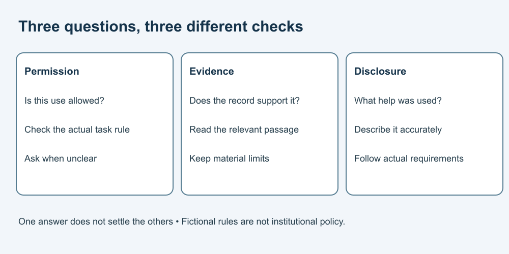

# 2. Separate permission from verification

[Course home](../README.md) · [Curriculum](../CURRICULUM.md)

## Objective

Apply a stated rule without assuming it covers a different task.

## Explanation

Institution, course, assessment and research rules can differ. Read the actual applicable instructions. When unclear, ask the instructor or appropriate research contact before the disputed use. Permission to brainstorm does not necessarily include drafting; permission to use a tool does not establish permission to upload restricted information.

The cards below are invented teaching examples, not actual institutional policies or laws. Disclosure cannot make prohibited assistance permitted. A tool's terms are another consideration, not a replacement for course rules.

## Worked example

Fictional cards:
- **A, study practice:** AI may suggest search terms. Write the final analysis yourself and note assistance.
- **B, assessment:** No AI assistance on this task.
- **C, research group:** “Use approved tools.” No approved-tool list is supplied.

Under A, asking for synonyms can fit; asking for a completed analysis does not. Under C, obtain the actual list and permitted data uses rather than guessing.

## Practice

Decide for each case: A/search terms; A/final argument; B/rewrite the answer; C/upload participant transcripts. Draft a clarification request for C that does not include the transcripts.

## Answer and reasoning

Attempt the practice before reading this section.

A/search terms fits the fictional rule and needs a note. A/final argument and B/rewrite conflict with their cards. C is unresolved: “Which tools and types of data are approved for this project, and who can confirm that before use?” Do not send restricted data just to ask whether you may send it.

## Transfer task

A new fictional rule allows critique of an outline but not generated prose. Explain why asking “Which question is missing from this outline?” differs from “Write section two.” The first can fit; the second does not. For a real task, use its real rule rather than these cards.

[Previous](01-question.md) · [Next](03-search.md)
