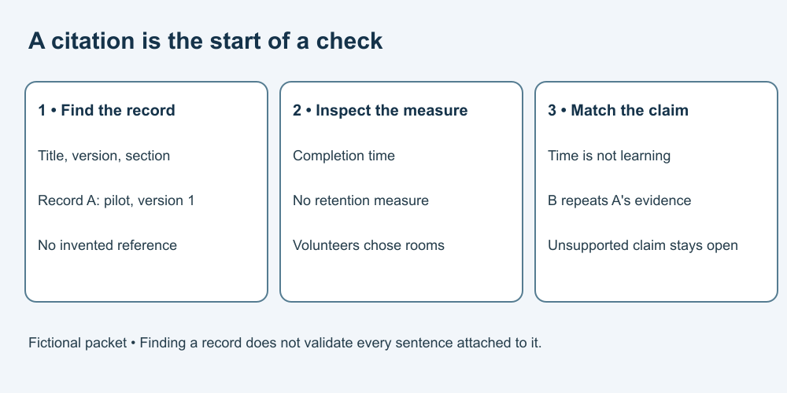

# 4. Trace a citation to a record

[Course home](../README.md) · [Curriculum](../CURRICULUM.md)

## Objective

Check source identity separately from the claim it is said to support.

## Explanation

Use the complete fictional packet below for Lessons 4–6. Every name, title and measurement is invented. Packet letters identify local teaching records; they are not real citations, URLs or studies.

**A — Reading-room pilot, Campus Exercise Group, 2026, version 1, section Results.** Six volunteers chose Room Q and six chose Room R. Each completed the same task once. No random assignment or baseline comparison. Times in minutes: Q = [8, 9, 10, 10, 11, 12]; R = [10, 11, 12, 12, 13, 14]. Learning retention was not measured.
**B — Campus bulletin, 2026, section News.** Repeats A's results; no new data.
**C — Comprehension exercise, Methods Class, 2026, section Results.** A different group completed a different task. Recorded mean score was 7/10 in each of two rooms. Assignment method and participant counts are not supplied.
**D — Fictional assistant statement.** “A proves quiet rooms improve learning by 50%.” No additional retrievable reference supplied.

## Worked example

Trace D's claim to A. The title and section identify a record in this packet, but its methods and measurements do not support D. Matching a citation to a record does not validate every attached sentence.

## Practice

Which records can be inspected here? Does B provide a second study? Which measurement in A would establish retained learning? Write a source note separating “found” from “supported.”

## Answer and reasoning

Attempt the practice before reading this section.

A, B and C are supplied records; D is an unsupported assertion to examine. B adds no independent study. A contains no retention measurement. Note: “Record A found in the fictional packet, Results; supports reported times only, not D's learning claim.” In real work, an unfound citation remains unverified; absence from one search does not prove it never existed.

## Transfer task

A fictional correction changes A's final Q value from 12 to 18 in version 2. Record both the version and change before analysing it. Do not silently mix versions. The revised list is [8, 9, 10, 10, 11, 18]. Calculation follows in Lesson 7. This is a teaching correction, not a real retraction.

[Previous](03-search.md) · [Next](05-evidence.md)
