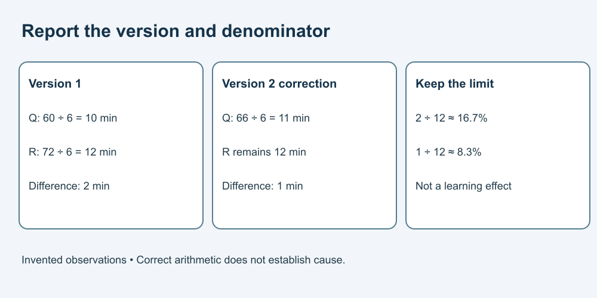

# 7. Check a small analysis

[Course home](../README.md) · [Curriculum](../CURRICULUM.md)

## Objective

Calculate the stated summaries and keep their interpretation bounded.

## Explanation

Use version 1 of A from [Lesson 4](04-citations.md). The mean is the sum divided by the number of values. For a sorted list of six values, the median is the average of the third and fourth. State units, list version and any exclusions.

These are descriptive summaries of invented data. Correct arithmetic does not make the study causal or representative. Do not remove inconvenient observations merely to improve a result.

## Worked example

Q sums to 60 across six times: mean 10 minutes; median 10. R sums to 72: mean 12 minutes; median 12. Q's mean is 2 minutes lower than R's in this packet.

Relative to R, that difference is 2/12 × 100, approximately 16.7%. Relative to Q it is 2/10 × 100 = 20%. State the denominator. Neither describes “50% more learning.”

## Practice

Use corrected version 2: Q = [8, 9, 10, 10, 11, 18]. Calculate the sum, mean and median. Compare the new mean with R's 12. What must a revised report say about the change?

## Answer and reasoning

Attempt the practice before reading this section.

The corrected sum is 66; mean 11 minutes; median remains 10. The mean difference is now 1 minute, or approximately 8.3% relative to R. Identify version 2 and the replacement of 12 by 18. The unchanged median does not mean the data were unchanged. Do not discard 18 without an actual documented reason.

## Transfer task

For a separate fictional list [2, 4, 6, 8], find mean and median: both are 5. For an empty list, neither ordinary mean nor median is available. Explain why a list with no observations must not be reported as a mean of zero. These examples are arithmetic practice, not statistical inference.

[Previous](06-synthesis.md) · [Next](08-method.md)
