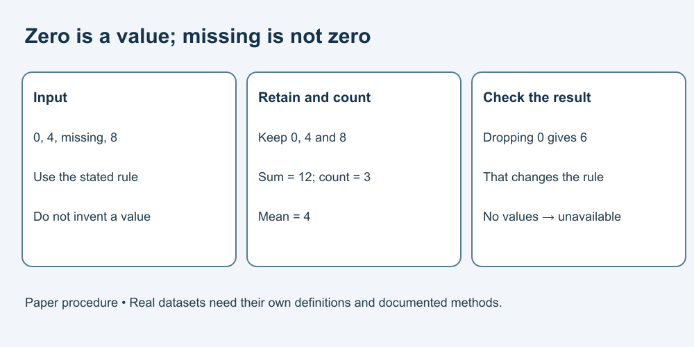

# 8. Leave a method another reader can inspect

[Course home](../README.md) · [Curriculum](../CURRICULUM.md)

## Objective

Trace a rule and document a reproducible calculation on paper.

## Explanation

A useful method record lets another reader see the inputs, version, units, steps and handling of missing values. Our paper procedure is deliberately small. It does not establish that an actual experiment or software pipeline is reproducible or secure.

Pseudocode describes steps without running software. No installation is required. “Missing” means no observed value in this exercise; zero is a valid recorded number and is different.

## Worked example

Input: [0, 4, missing, 8].

Correct procedure:
```text
sum = 0; count = 0
for each item:
    if item is not missing:
        add item to sum
        add 1 to count
if count = 0: report unavailable
otherwise: report sum / count
```

Running (sum, count): (0,1), (4,2), (4,2), (12,3). Mean = 4. A buggy “if item > 0” would omit the valid zero and report 6.



## Practice

Trace [0, missing, 6]. Then trace [missing, missing]. Write a method note specifying the missing-data rule and why no invented value was inserted.

## Answer and reasoning

Attempt the practice before reading this section.

The first list has sum 6, count 2 and mean 3. The second has count 0 and reports unavailable. Note: “For this paper example, skip items explicitly marked missing; retain zero; divide the sum by the retained count, or report unavailable if none.” This rule suits the exercise, not every research dataset.

## Transfer task

A separate dataset defines “-1” as a missing-value code in its documentation. Can you use our rule unchanged? No: read that dataset's definition and document the different handling. In other data, -1 may be valid. State the rule before calculation and keep a change record rather than silently editing inputs.

[Previous](07-data.md) · [Next](09-responsibility.md)
