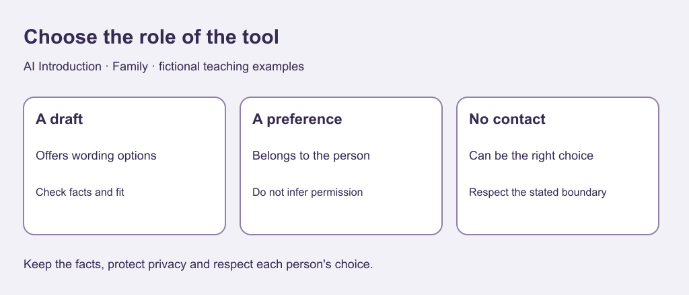

# 1. Choose whether a tool belongs

[Course home](../README.md) · [Next](02-facts.md)

## Objective

Choose a writing task while keeping human choices with people.

## Explanation

Families can include relatives, partners, chosen family and people living apart. There is no single model of closeness or frequency of contact that everyone must follow. Use the fictional situations here without disclosing your own relationships.

Generative AI can suggest wording but cannot supply another person's wishes. It may produce a confident interpretation without knowing their intentions. A note, a conversation where wanted and safe, or no message can be a better choice.

Ask: What do I mean to communicate? Would a draft help? Is contact wanted and appropriate? Who checks the wording? Choosing no AI can be a successful result.

Text equivalent: A writing draft can offer options. Preferences belong to people. No contact can be the right choice.

## Worked example

Ari wants titles for a booklet of made-up recipes. Brainstorming or a draft can supply options. Ari also wonders whether a cousin wants a visit. A title generator cannot answer that preference question. A writing task is not permission to contact someone.

## Practice

Choose a route and a check:

A. Invent titles for a fictional booklet.

B. Determine why someone has not replied.

C. Add 10 and 15 minutes for a plan.

D. Write to someone who explicitly requested no contact.

## Answers and checking

A: brainstorm or review a draft for fit and invented claims. B: the motive remains unknown; guesses are not facts. C: arithmetic or calculator, total 25. D: do not use the exercise to bypass the boundary. These are task choices, not diagnoses.

## Try independently

Invent a small writing task. State its purpose, one limit and a reason to choose no tool. Use no real correspondence.

[Sources and limits](../SOURCES.md) · [Reuse terms](../LICENSE.md)
