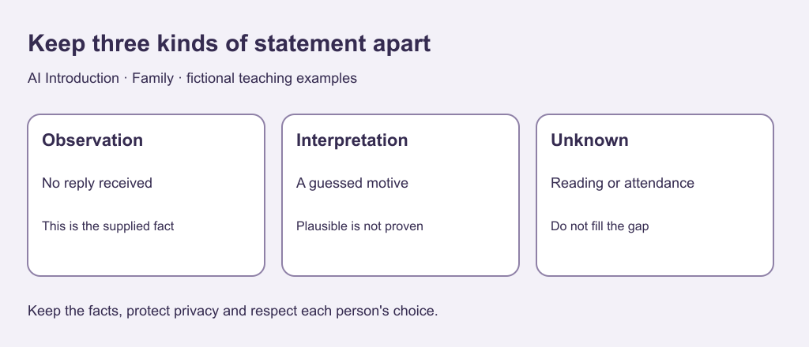

# 2. Separate facts from guesses

[Previous](01-choice.md) · [Course home](../README.md) · [Next](03-requests.md)

## Objective

Distinguish observations, interpretations and unknown intentions.

## Explanation

An observation describes what the supplied evidence shows. An interpretation explains what it might mean. Several explanations can fit one observation; listing possibilities does not establish any of them.

A generated account may fill gaps to sound coherent. Mark those gaps instead. A neutral question may be appropriate when contact is welcome, but another person need not explain every choice. Silence is neither proof of motive nor permission.

Text equivalent: Observation: no reply received. Interpretation: a guessed motive. Unknown: reading, reasons and attendance.

## Worked example

Fictional card: an invitation was sent Monday. By Wednesday no reply has been received. No other facts are supplied.

Observation: no reply received by Wednesday. Interpretation: the recipient dislikes the sender. Unknown: whether it was read, whether they are busy and whether they want to attend. Plausibility is not evidence.

## Practice

Classify as supplied fact, interpretation or unknown:

A. Invitation sent Monday.

B. The recipient is deliberately insulting the sender.

C. The invitation was read.

D. No reply received by Wednesday.

E. Attendance is agreed.

Rewrite “They clearly do not care” using only the evidence.

## Answers and checking

A and D are supplied facts; B is an interpretation; C and E are unknown. No reply establishes neither reading nor agreement. Rewrite: We have not received a reply by Wednesday; the reason is unknown. Do not send repeated messages to force clarity.

## Try independently

Create a fictional observation and two possible explanations. Label both as possibilities and identify missing evidence.

[Sources and limits](../SOURCES.md) · [Reuse terms](../LICENSE.md)
