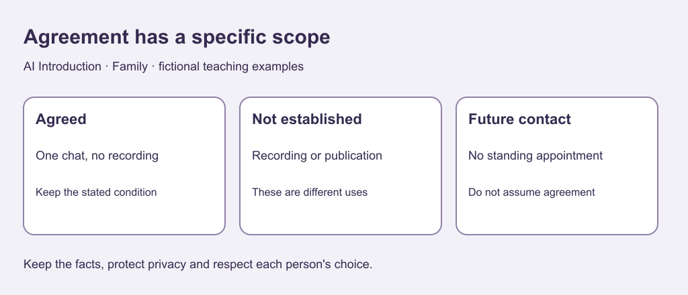

# 4. Make participation optional

[Previous](03-requests.md) · [Course home](../README.md) · [Next](05-privacy.md)

## Objective

Distinguish specific agreement from silence or permission for another use.

## Explanation

An invitation offers a choice without guilt for declining. Agreement to one activity does not automatically cover recording, publicity or later activities. Here consent means a practical, specific agreement, not a legal definition for every context.

Ask about different uses separately. Do not use AI to produce increasingly persuasive responses to a decline. A plan fitting an available time still needs agreement.

Text equivalent: Agreement to one unrecorded chat does not authorize recording, publication or future appointments.

## Worked example

Offer: Would you like a 20-minute story chat? It is fine to decline; no recording is planned.

Reply: I would like to join, but please do not record.

Agreed: that chat without recording. Not agreed: a recording, public upload or standing future appointment.

## Practice

Assess these conclusions:

A. That chat without recording is agreed.

B. Publication of the story is also agreed.

C. A different invitee did not reply, so attendance is confirmed.

D. A decline can be acknowledged and left there.

Write a respectful acknowledgment.

## Answers and checking

A follows the reply. B is not established. C wrongly treats silence as agreement. D respects choice. Example: Thanks for letting me know; I will leave it there. Do not demand an explanation or make attendance a test of affection.

## Try independently

Create a fictional invitation stating the activity, a limit and an easy decline. Name two uses acceptance would not authorize.

[Sources and limits](../SOURCES.md) · [Reuse terms](../LICENSE.md)
