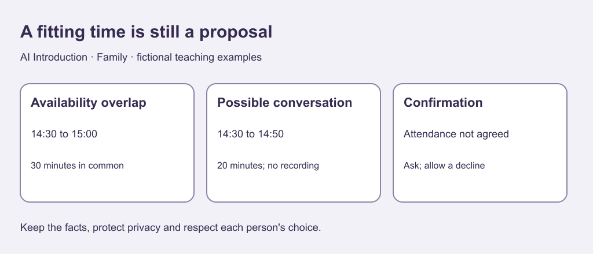

# 7. Check a plan without assuming agreement

[Previous](06-boundaries.md) · [Course home](../README.md) · [Next](08-disagreement.md)

## Objective

Calculate an overlap and preserve unconfirmed preferences.

## Explanation

Scheduling involves arithmetic and agreement. A free interval is a possible time, not willingness to participate. Check duration, format and limits before offering a proposal.

The cards use one fictional local time zone and exact exercise durations. Real arrangements require confirmation. Revising or declining a plan does not diagnose the relationship.

Text equivalent: Availability overlaps from 14:30 to 15:00. A 20-minute proposal can fit, but participation still needs confirmation.

## Worked example

Card A: Morgan available 14:00–15:00, no recording.
Card B: Jules available 14:30–15:15, can consider a 20-minute conversation.
No invitation accepted.

Overlap: 14:30–15:00, 30 minutes. A 14:30–14:50 proposal fits, leaves 10 minutes within the overlap and remains unrecorded. It is still a proposal.

## Practice

Evaluate these 20-minute options:

A. 14:20–14:40.

B. 14:40–15:00.

C. 14:50–15:10.

Which fits both windows? Does it confirm attendance? What recording limit remains? Propose a 15-minute option too.

## Answers and checking

A starts before Jules is available. B fits. C ends after Morgan is available. Attendance is unconfirmed and no recording remains the limit. A 15-minute example is 14:35–14:50; other intervals wholly within 14:30–15:00 work. They are proposals, not bookings.

## Try independently

Write a proposal with the fitting interval, no recording and a request for confirmation. Do not send it. Explain “fits” versus “agreed.”

[Sources and limits](../SOURCES.md) · [Reuse terms](../LICENSE.md)
