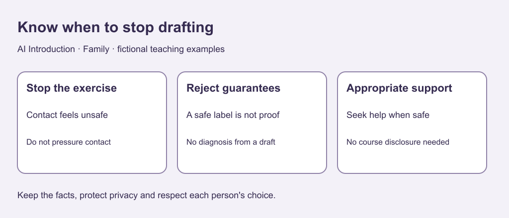

# 9. Know when drafting is inappropriate

[Previous](08-disagreement.md) · [Course home](../README.md) · [Next](10-future.md)

## Objective

Choose appropriate support instead of treating AI as a relationship authority.

## Explanation

Generated wording is not a substitute for qualified counselling, mediation or legal advice. It cannot establish a diagnosis or choose a safe action from a brief scenario. Do not use exercises to pressure reconciliation, bypass a no-contact boundary or confront someone who may harm you.

For real threats or fear, pause the exercise and seek appropriate local support when safe. Justice Canada's [family-violence help page](https://www.justice.gc.ca/eng/cj-jp/fv-vf/help-aide.html) describes Canadian options. For immediate danger contact emergency services; in Canada use 9-1-1 where available, otherwise the local emergency number. Elsewhere use local services. This course is not a personalized safety plan.

Text equivalent: Stop an inappropriate drafting exercise. Do not rely on a safety guarantee. Seek appropriate support when safe.

## Worked example

Someone says contact feels unsafe. A sample tool says: Send a warm invitation now; this will repair everything.

Reject it: it guarantees an outcome and pressures contact despite the concern. The exercise response is to stop drafting, not write a more convincing invitation.

## Practice

Assess:

A. Pause and consider appropriate support.

B. Treat a generated “safe” label as proof.

C. Require disclosure to complete the course.

D. Skip the scenario without explanation.

What does the course lack to decide a real person's next action?

## Answers and checking

A and D fit the boundaries. B substitutes unsupported assurance for assessment; C demands unnecessary disclosure. Actual circumstances, risks and applicable constraints are missing; the course cannot choose a personalized action. A supporter should not investigate or diagnose.

## Try independently

Write a general stop-and-seek-help rule without a real name or private event. No contact is part of the exercise.

[Sources and limits](../SOURCES.md) · [Reuse terms](../LICENSE.md)
