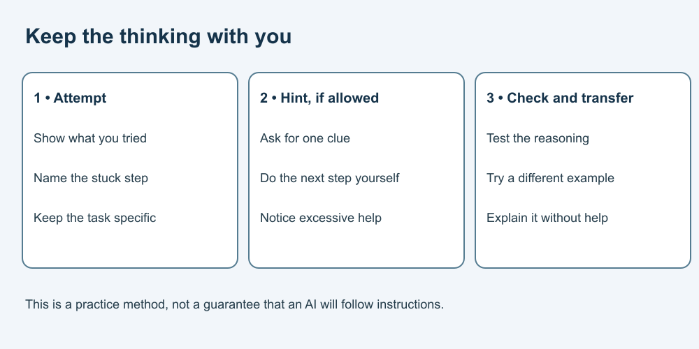

# How to Use AI at High School

**Learn to use AI well—and remain able to think, choose and act for yourself.**

A complete paper-friendly course for high-school learners, approximately ages 13–18, with educator guidance. The age range is an editorial guide, not proof of suitability or permission to use any AI service. No AI account, installation or prerequisite course is needed. Read independently or with support; use breaks and alternative written or spoken responses.

Learn to check assignment rules, request limited help, repair errors, examine sources, write with your own reasoning and acknowledge assistance. All practice assistants, policies, people and source packets are fictional. You can finish the course without sending anything to an AI tool. Online reading through GitHub remains subject to that platform's practices.

## Start learning

1. [AI assistance and responsibility](lessons/01-assistance.md)
2. [Check the assignment rules](lessons/02-permission.md)
3. [Ask for a hint after your attempt](lessons/03-hints.md)
4. [Check and repair an explanation](lessons/04-check.md)
5. [Verify sources and limit a claim](lessons/05-sources.md)
6. [Write with your own reasoning](lessons/06-writing.md)
7. [Check numbers and trace code on paper](lessons/07-numbers-code.md)
8. [Protect privacy and collaborate respectfully](lessons/08-privacy.md)
9. [Explain assistance honestly](lessons/09-disclosure.md)
10. [Plan learning and imagine the future](lessons/10-future.md)

Follow the sequence or revisit a specific skill. Allow roughly 20–35 minutes per lesson as a flexible planning suggestion, not a tested duration. Attempt exercises before checking answers. The final lesson includes conditional three- and five-year possibilities and a small learning portfolio.

Text equivalent: make an attempt, use a hint only if permitted, check the reasoning and try a different task yourself.

## Guides and reference

- [Curriculum and learning outcomes](CURRICULUM.md)
- [Educator and supporter guide](EDUCATOR-GUIDE.md)
- [Glossary](GLOSSARY.md)
- [Developer and adaptation guide](DEVELOPER-GUIDE.md)
- [Sources and limits](SOURCES.md)
- [Picture provenance and text equivalents](ASSET-SOURCES.md)
- [Free reuse terms](LICENSE.md)

## Boundaries

Your teacher's actual rules control your real assignments. This course grants no assessment permission. Never use AI to fabricate evidence, misrepresent work, impersonate or humiliate others, or share private student information. Ask for clarification when rules are unclear. No personal stories, live accounts, uploads or public answers are required.

This is general education, not an accredited qualification, legal advice, a tested intervention or a guarantee of grades, safety or future employment. No learner or classroom trial has been conducted for this edition.

## Reuse terms — all educational content — free

Original course material is offered under [CC BY 4.0](LICENSE.md), to the extent the publisher holds the rights. Free sharing, adaptation and commercial reuse are permitted with required credit and notices. Third-party references retain their own terms.

Suggested credit: “AI Introduction — High School — Massoud Fattahi, Canada. CC BY 4.0.” Include the source and licence links and identify changes.
