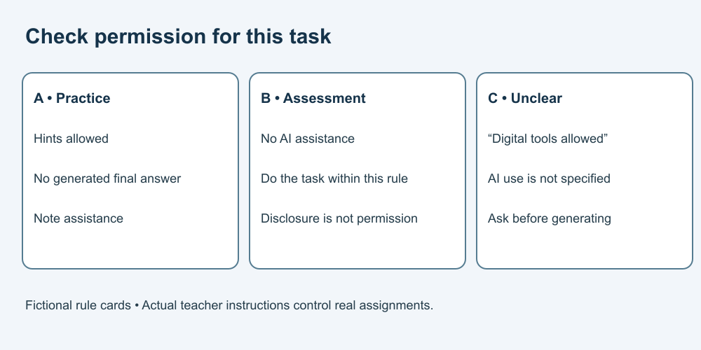

# 2. Check the assignment rules

[Course home](../README.md) · [Curriculum](../CURRICULUM.md)

## Objective

Decide when to proceed within a stated rule and when to ask for clarification.

## Explanation

Schools and assignments can have different rules. This course does not grant permission to use AI on an assessment. Permission to use a calculator, search engine or spelling aid does not by itself grant permission to generate an essay. If rules are unclear or conflict, ask the teacher before the disputed use.

The following cards are invented for practice. They are not laws or any school's published policy. Honest acknowledgement does not turn a prohibited use into a permitted one.

## Worked example

Fictional rule cards:

- **A — practice:** AI hints are allowed; generated final answers are not. Note any assistance.
- **B — assessment:** Do this task without AI assistance.
- **C — project:** “Digital tools may be used.” Nothing else is specified.

Under A, asking for one hint can fit the rule. Under B, asking AI to rewrite the response does not fit. Under C, ask which tools and uses are permitted before generating content.

## Practice

For each request, use A, B or C and decide permitted, prohibited or unclear:

1. Under A: “Give one clue, without solving the problem.”
2. Under A: “Write my final response.”
3. Under B: “Improve the whole answer.”
4. Under C: “Generate the first draft.”

Draft a short clarification question for case 4.

## Answer and reasoning

Try the practice before reading this section.

1 fits A, and assistance must be noted. 2 and 3 conflict with their cards. 4 is unclear. A suitable question is: “Does digital tools include AI drafting for this project, and what acknowledgement would you require?” Do not assume silence is permission.

## Transfer task

A new fictional rule says: “AI may suggest outline questions, but all prose must be written by you.” Could you ask for paragraph text? No. Could you ask which questions an outline should address? Yes within that rule. Explain why those requests differ, without treating this fictional rule as permission for your real class.

[Previous](./01-assistance.md) · [Next](./03-hints.md)
