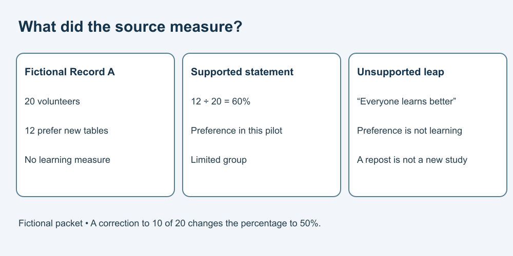

# 5. Verify sources and limit a claim

[Course home](../README.md) · [Curriculum](../CURRICULUM.md)

## Objective

Separate what a source actually supports from an exaggerated conclusion.

## Explanation

A citation-looking string is not proof that a source exists or supports a claim. Open and inspect the relevant original source when available. Check who produced it, what was measured, when, and which group it describes. A second page copying the first is not a second independent study.

For this offline exercise, use only the complete fictional packet below. No web search or personal information is needed.

## Worked example

**Fictional library packet — invented for this lesson, not research:**

- **Record A, pilot note, 4 March:** Twenty volunteers tried two table arrangements. Twelve said they preferred the new arrangement. The pilot did not measure grades or learning.
- **Record B, newsletter, 6 March:** Repeats Record A's counts and cites A; no new participants or measurements.
- **Record C, assistant claim:** “A major study proves the new tables improve every student's learning by 60%.” It supplies no retrievable source.

## Practice

Calculate the preference percentage in A. Does B add independent evidence? Which parts of C exceed A? Write a supported replacement sentence.

Then imagine a separate new sample: 9 of 15 volunteers prefer an arrangement. Does its matching percentage prove the same people were surveyed?

## Answer and reasoning

Try the practice before reading this section.

12 ÷ 20 × 100 = 60%. B repeats A and adds no independent evidence. C changes preference into learning, volunteers into every student, and a small pilot into proof. Replacement: “In this fictional pilot, 12 of 20 volunteers preferred the new arrangement; learning was not measured.”

9 ÷ 15 × 100 is also 60%, but matching percentages do not establish identical participants or methods.

## Transfer task

A fictional correction says: “Two responses were recoded; 10 of the same 20 volunteers preferred the arrangement.” Revise the percentage and sentence: 50%, with a note that you used the corrected count. Retain the limitation about learning. If the underlying record cannot be found in a real task, mark the claim unverified rather than inventing a citation.

[Previous](./04-check.md) · [Next](./06-writing.md)
