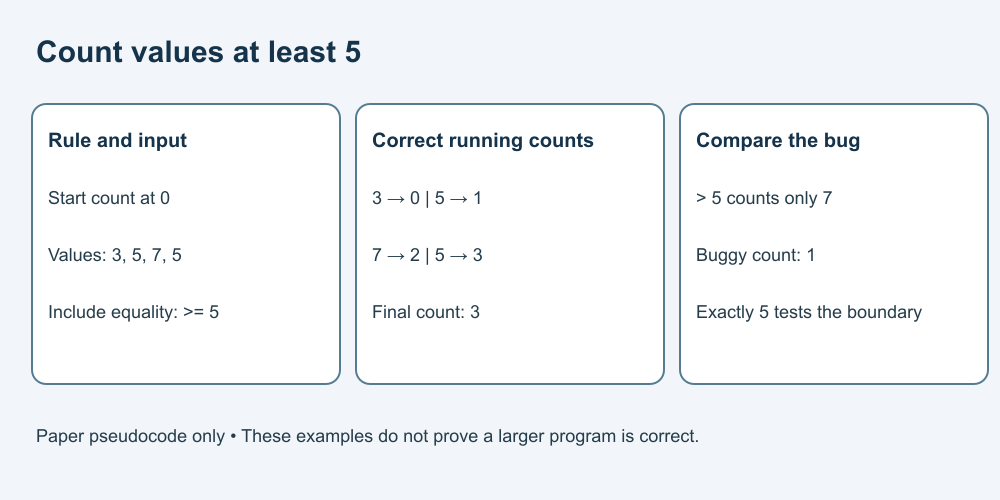

# 7. Check numbers and trace code on paper

[Course home](../README.md) · [Curriculum](../CURRICULUM.md)

## Objective

Test a small algorithm against a stated rule, including its boundary.

## Explanation

An algorithm is a sequence of steps. Code expresses steps in a language a computer can process. Here we use plain pseudocode only; do not install or run anything. Compare the steps with the stated requirement, then trace one value at a time. A plausible output is not enough.

For larger real programs, a few examples cannot establish correctness or security. This exercise teaches a small checking method, not permission to run unknown code.

## Worked example

Requirement: count values **at least 5** in [3, 5, 7, 5].

Fictional buggy pseudocode:
```text
count starts at 0
for each value:
    if value > 5:
        add 1 to count
report count
```

This returns 1, because only 7 is greater than 5. “At least” includes equality: change the comparison to value >= 5. The corrected count becomes 3.



## Practice

Trace both versions for [5, 1, 8]. Write each running count. Which input tests equality? Also calculate the mean of the original list [3, 5, 7, 5], showing the sum and number of values.

## Answer and reasoning

Try the practice before reading this section.

For [5, 1, 8], buggy running counts are 0, 0, 1; corrected counts are 1, 1, 2. The value 5 tests equality. For the original list the sum is 20, there are 4 values and the mean is 5. A mean of 5 does not mean every value equals 5.

## Transfer task

Test the corrected rule on [4, 5, 6] and on an empty list. Answers: 2 and 0. Explain why count starts at 0 and why equality matters. Do not calculate an ordinary arithmetic mean for the empty list: there are no values and division by zero is not defined. These tests address this tiny rule only.

[Previous](./06-writing.md) · [Next](./08-privacy.md)
