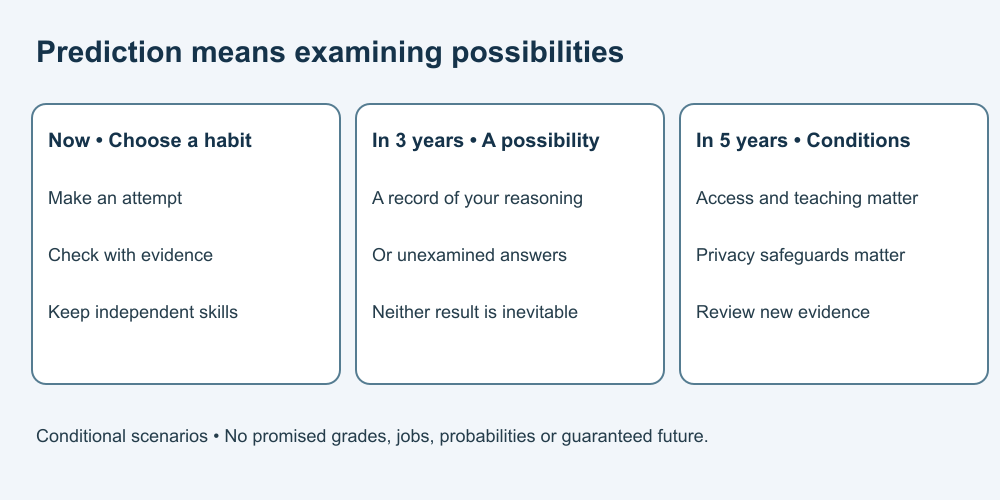

# 10. Plan learning and imagine the future

[Course home](../README.md) · [Curriculum](../CURRICULUM.md)

## Objective

Build a checkable study plan and separate scenarios from predictions of certainty.

## Explanation

Choose a specific learning task. Plan an attempt, check your reasoning and reflect on what still needs work. EEF's [learning guidance](../SOURCES.md) supports task-specific planning, monitoring and evaluation; it does not validate this course or promise a particular result from AI.

Measure what you can explain or do independently, not how many answers a tool produces. You may choose no AI. Different access needs, subjects and school rules call for different methods.

## Prediction: possible worlds in three and five years

These are conditional stories, not forecasts or promises. In three years, a learner who regularly checks permitted hints against evidence might have a useful record of independent solutions. If they only collect generated answers, they might still struggle with an unfamiliar task. Neither result is inevitable.

In five years, schools could offer better supported, privacy-conscious assistance if they invest in access, teaching and safeguards. Unequal access or poorly chosen tools could instead widen difficulties. We assign no probabilities, grade improvements or career outcomes. Revisit assumptions as evidence changes.

## Worked example

Fictional plan: “This week I will solve three practice equations on paper, check by substitution, then explain one new equation without help. If I remain stuck, I will ask my teacher about the specific step.” AI hints are optional and only within the relevant rule.

## Practice

Create your plan with a task, permitted support, an independent check and a next action if stuck. Then complete a small portfolio: decide a permission case from Lesson 2; repair an equation; limit a claim from Record A; trace a boundary case; choose a privacy-safe example; write an honest activity note.

## Answer and reasoning

Try the practice before reading this section.

A useful plan has observable work and a way to detect misunderstanding. Portfolio answers should follow the supplied rules, show corrected reasoning, preserve “preference, not learning,” include equality at 5, use invented data and accurately describe help. Use the [educator guide](../EDUCATOR-GUIDE.md) for feedback, not a credential.

## Transfer task

Write one three-year possibility in the form “If …, then … might …; this depends on …; I would look for … evidence.” Replace “AI will guarantee my success” with a conditional claim. Explain one skill you want to retain even when tools change. There is no single correct personal goal, and no requirement to share it publicly.

[Previous](./09-disclosure.md) · [Return to course home](../README.md)
