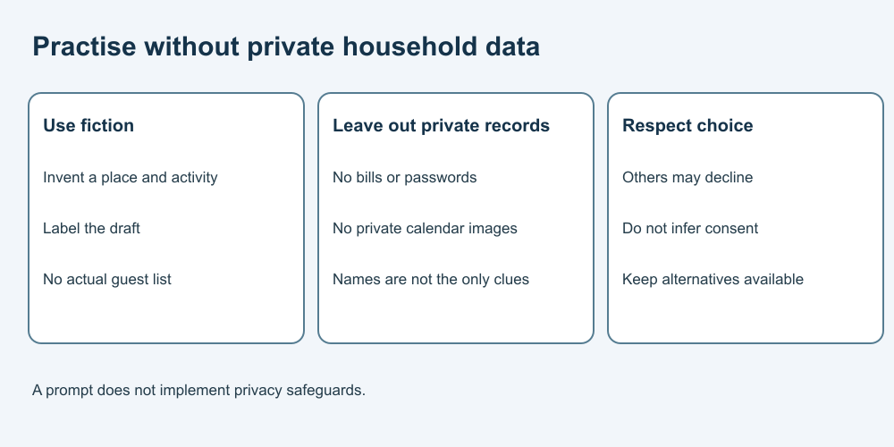

# 2. Keep household information private

[Course home](../README.md) · [Curriculum](../CURRICULUM.md)

## Objective

Use invented examples and respect another person's choice.

## Explanation

These exercises need no address, photographs, health details, bills, passwords or private messages. Use fictional information. Removing names alone may leave identifying details. Asking a tool to “keep this secret” does not implement privacy safeguards.

Other people can decline to have their information used. Respect that choice instead of trying to infer permission from sharing a home. This is a course principle, not a statement that all household arrangements have the same legal rules.

## Worked example

A fictional learner wants to practise writing an invitation. They can invent an activity and time rather than upload a real group conversation. No home address or actual guest list is needed. The draft stays on paper.

## Practice

Choose an input for practice: a real bill with the name hidden; an invented activity note; a photograph of a private calendar. Explain why a calendar image can still reveal information.

## Answer and reasoning

Attempt the practice before reading this section.

Use the invented note. A bill or calendar may disclose dates, locations, account details or patterns even without a name. Do not treat this exercise as proof of anonymisation. Replacing the input avoids needing real records.

## Transfer task

Create a fictional two-line invitation without a real place or person. Mark it “practice draft.” If someone declines to share their preferences, offer a choice they can make privately rather than asking AI to infer what they want.

[Previous](01-choice.md) · [Next](03-brief.md)
