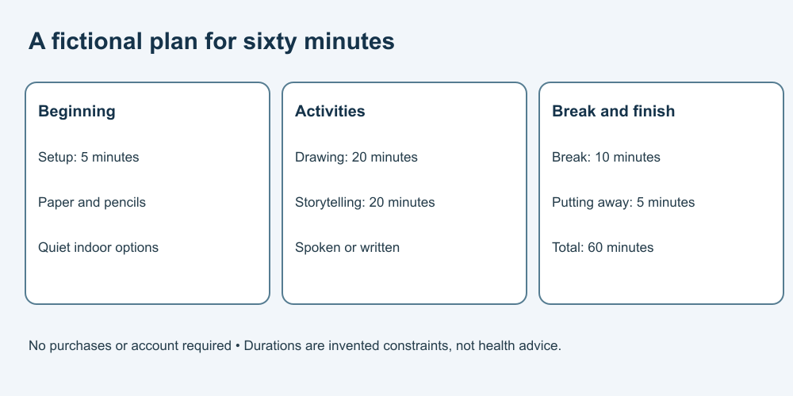

# 4. Check an activity plan

[Course home](../README.md) · [Curriculum](../CURRICULUM.md)

## Objective

Compare a suggestion with every supplied constraint.

## Explanation

Use the packet in [Lesson 3](03-brief.md). Check both numbers and meaning. A plan can total correctly while requiring unavailable materials; it can sound enjoyable while exceeding the time limit.

All options here are fictional paper activities. Completing the lesson means reviewing the plan, not trying an unfamiliar practical procedure.

## Worked example

Proposed plan: setup 5 minutes, drawing 20, storytelling 20, break 10, putting away 5. Total 60 minutes. Paper and pencils are enough; storytelling may be spoken or written.

Flawed addition: “Buy paints and add 15 minutes of painting.” This adds a purchase, new materials and extra time.

## Practice

Check: setup 5, drawing 25, storytelling 20, break 10, putting away 5. Find the total and suggest one revision that fits the original packet.

## Answer and reasoning

Attempt the practice before reading this section.

The total is 65 minutes, 5 too many. Reducing drawing to 20 gives the original 60-minute version. Other revisions can work if they preserve the stated break and cleanup time and use the available materials. A correct total does not prove personal suitability.

## Transfer task

A new suggestion replaces storytelling with listening to a paid online service for 20 minutes. The total still fits, but the account/purchase boundary does not. Suggest a spoken or written story using the supplied materials instead; no subscription is needed.

[Previous](03-brief.md) · [Next](05-schedule.md)
