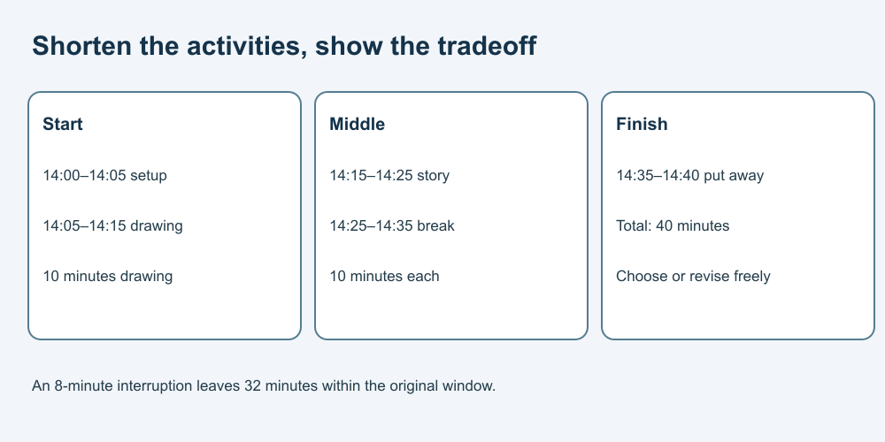

# 5. Revise time without hiding tradeoffs

[Course home](../README.md) · [Curriculum](../CURRICULUM.md)

## Objective

Build a shorter plan while keeping stated needs visible.

## Explanation

Plans are estimates, not obligations. Include transitions and the stated break rather than compressing every activity into unrealistic fragments. If the available time changes, make the tradeoff explicit.

You can stop, skip or choose another activity. The schedule is not medical advice about breaks or a claim about anyone's attention span.

## Worked example

For the new 40-minute limit, one plan is setup 5, drawing 10, storytelling 10, break 10, putting away 5. Total 40. Beginning at fictional 14:00 gives boundaries 14:05, 14:15, 14:25, 14:35 and 14:40.

## Practice

A fictional interruption uses 8 minutes from the original 40-minute window. How much remains? Propose a revised allocation preserving setup 5, break 10 and putting away 5. Do not require the learner to rush.

## Answer and reasoning

Attempt the practice before reading this section.

32 minutes remain. The preserved blocks total 20, leaving 12 for activities. One option gives drawing 6 and storytelling 6; another chooses a single 12-minute activity. A person may instead stop or reschedule. There is no single correct preference.

## Transfer task

Starting the 40-minute plan at 15:20, when would it finish? 16:00. If a real obligation must end earlier, confirm that constraint and revise the plan; do not assume an AI suggestion overrides it.

[Previous](04-plan.md) · [Next](06-materials.md)
