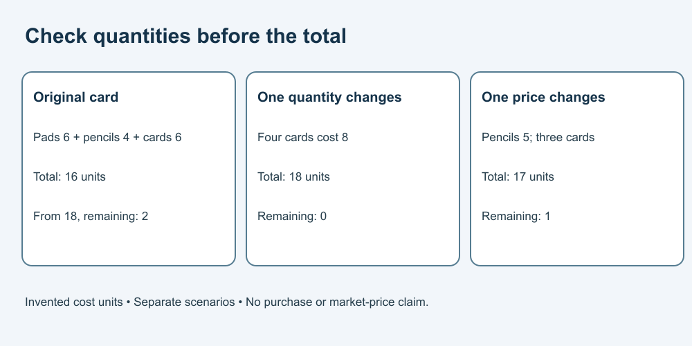

# 6. Check a list and its arithmetic

[Course home](../README.md) · [Curriculum](../CURRICULUM.md)

## Objective

Use supplied quantities and fictional prices correctly.

## Explanation

This lesson is arithmetic practice, not a shopping recommendation or financial advice. No purchase is required. Real prices and charges would need current verification before a real decision.

For a separate hypothetical paper project, use this price card: 2 pads at 3 units each, 1 pencil pack at 4 units, and 3 cards at 2 units each. These are invented cost units, not quoted currency or product prices. The card states no additional charges for this exercise only.

## Worked example

Pads cost 6, pencils 4 and cards 6: total 16 units. With a fictional limit of 18, 2 remain. If an assistant reports 14, check the row multiplication before using the total.

## Practice

Change the card quantity to 4. Calculate the new row total, overall total and amount remaining from 18. Does the unchanged budget mean you should make a purchase?

## Answer and reasoning

Attempt the practice before reading this section.

Cards now cost 8; total is 18; remaining amount is 0. The exercise authorizes no purchase. It only checks arithmetic under the supplied assumptions. A real comparison would need actual price, quantity and applicable charges.

## Transfer task

A revised pencil-pack price is 5 instead of 4, with the original three cards. Total becomes 17, leaving 1 from 18. Identify which version you used. Do not combine an old price with a new quantity unless that is the stated scenario.

[Previous](05-schedule.md) · [Next](07-create.md)
