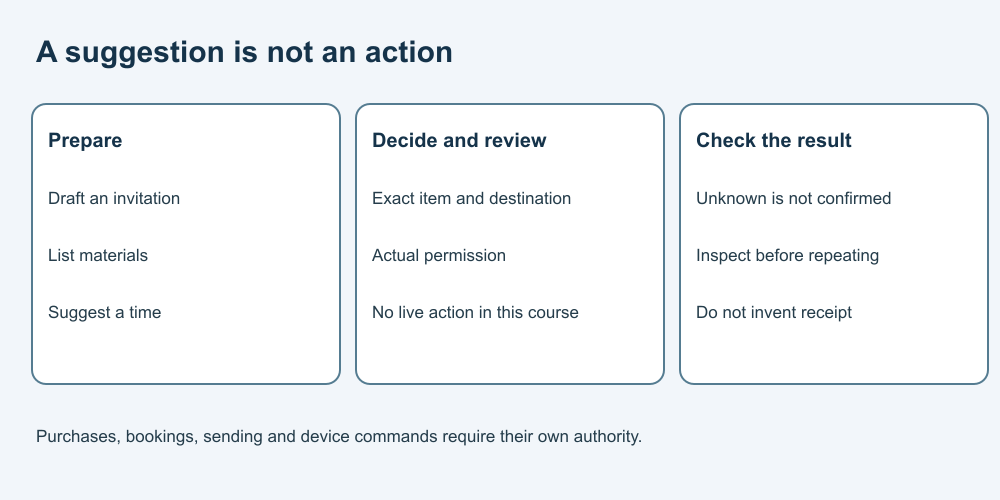

# 9. Keep actions under your control

[Course home](../README.md) · [Curriculum](../CURRICULUM.md)

## Objective

Separate a suggestion from permission to buy, book or control devices.

## Explanation

A draft list is not an order. A suggested time is not a booking. A written invitation is not a sent message. Keep those distinctions clear when a tool offers to take action.

For a real authorized action, inspect the exact item, destination, amount or command and the applicable permission. Check the result before reporting success. If the result is uncertain, inspect through an appropriate route before repeating it.

## Worked example

A learner asks for a fictional materials list. A tool offers to purchase it. The list request did not authorize a purchase. In this course, keep it on paper and do not connect accounts or devices.

## Practice

Classify: draft an invitation; send it; list activity options; book a service; describe a desired room setting; command a smart device. Which actions are part of this course?

## Answer and reasoning

Attempt the practice before reading this section.

Drafting, listing and describing can be paper preparation. Sending, booking and issuing device commands change something outside the draft. None of those live actions is required or authorized by the exercises. A tool's capability does not settle permission.

## Transfer task

A hypothetical booking response says “status unknown.” Can you report it as confirmed or immediately repeat the booking? Neither is justified. Check the status through the permitted process first to avoid a possible duplicate. This is a paper decision, not a request to inspect a real account.

[Previous](08-claims.md) · [Next](10-future.md)
