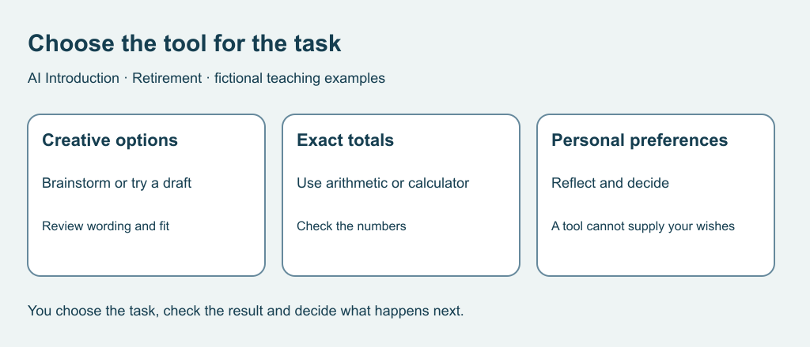

# 1. Choose something worth doing

[Course home](../README.md) · [Next](02-questions.md)

## Objective

Choose a task and explain whether AI, an ordinary tool or no tool fits.

## Explanation

Retirement is a life context, not an age threshold or ability rating. Interests, responsibilities and available time differ. You decide what matters; the course does not grade your speed.

Generative AI produces content in response to input. Fluent wording is not proof of accuracy. Whether a product can access files or take actions depends on its tools and permissions, not its conversational tone. All activities here use supplied fictional responses: no account is needed.

Begin with something small that you can check. Creative options may benefit from a draft. Exact totals suit arithmetic or a calculator. Your personal preference remains yours, even if a tool lists alternatives.

Text equivalent: Creative options may use a draft; exact totals suit arithmetic; personal preferences remain yours.

## Worked example

Sam wants three titles for a fictional garden story. Sam can brainstorm or ask for options and review their fit. Sam also needs to add 8, 12 and 5 minutes: the total is 25. A calculator avoids unnecessary generated explanation. No tool can decide whether Sam wants company this afternoon.

## Practice

Choose a route and check for each task:

A. Invent two names for a fictional reading circle.

B. Add 15, 10 and 5 minutes.

C. Decide whether you want a quiet afternoon or company.

D. Establish whether an actual event is cancelled today.

## Answers and checking

A: brainstorm or review an AI draft; avoid false affiliation claims. B: arithmetic or calculator, total 30. C: reflect on your wishes; an options list does not supply your preference. D: use current organizer information through an independently located official route. A generated claim is insufficient. More than one method can work if its limits are explained.

## Try independently

Pick a fictional low-stakes project. State the result, a check and a reason you might choose a simpler tool.

[Sources and limits](../SOURCES.md) · [Reuse terms](../LICENSE.md)
