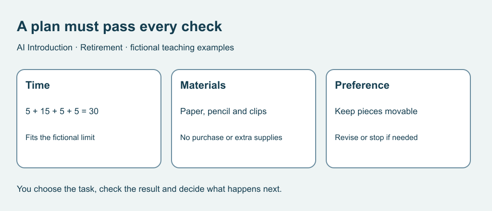

# 3. Check a hobby plan

[Previous](02-questions.md) · [Course home](../README.md) · [Next](04-evidence.md)

## Objective

Check time, materials and preferences separately.

## Explanation

A proposed plan is a draft. A correct total can still hide unavailable materials or an unwanted activity. Check each requirement: time, supplies, purchases, location and choice. Leave room to pause or change your mind.

The times below are invented exercise limits, not recommended activity durations. Revising one step is often more useful than accepting or rejecting the entire plan.

Text equivalent: Check time, materials and preferences separately. Five plus fifteen plus five plus five equals thirty minutes.

## Worked example

Brief: Rowan wants a 30-minute paper collage session. Supplies: scrap paper, pencil and reusable clips. No glue, scissors, purchases or travel. Pieces should remain movable.

Candidate: choose paper 5 minutes, arrange whole sheets 15, sketch borders 5, tidy 5. Total 30. It fits the supplies and movable-piece preference. Rowan may shorten or stop it.

## Practice

Candidate B: buy glue 10 minutes, cut paper 10, glue pieces 15, tidy 5.
1. Calculate the total.
2. Name every mismatch.
3. Revise to fit 25 minutes using only listed supplies.
4. Explain why arithmetic alone is insufficient.

## Answers and checking

B totals 40 minutes. It exceeds 30, adds shopping, requires unavailable glue and scissors, and fixes the pieces. One alternative: choose whole sheets 5, arrange 10, sketch 5, tidy 5: total 25. Other fitting answers work. A correct sum would not settle materials or preferences.

## Try independently

Reduce the available time to 15 minutes and check again. One fitting plan: choose 3, arrange 7, sketch 2, tidy 3. Explain what was simplified.

[Sources and limits](../SOURCES.md) · [Reuse terms](../LICENSE.md)
