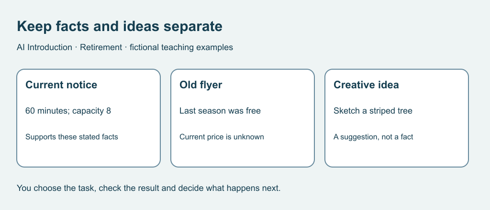

# 4. Separate a suggestion from a fact

[Previous](03-hobby.md) · [Course home](../README.md) · [Next](05-learning.md)

## Objective

Classify claims against supplied evidence without filling gaps with guesses.

## Explanation

A creative idea need not be a factual report. A factual claim needs evidence with the right scope and date. A citation-looking sentence is not enough: inspect what the source says. An old notice may explain history without establishing current arrangements.

The following cards are the complete fictional packet for this exercise, not real events. For actual arrangements, consult the actual organizer.

Text equivalent: A current notice supports stated duration and capacity. An old flyer does not establish current price. A creative idea is separate.

## Worked example

Card A, current exercise notice: River Room sketch group, Thursday 14:00–15:00; bring paper; room capacity 8; booking required. No price listed.

Card B, older exercise flyer: Last season's session was free.

Claim: the current session lasts one hour. Supported by A. Claim: the current session is free. Not established. Suggestion: sketch a striped tree. Creative, not a notice fact.

## Practice

Classify as supported, contradicted, not established or creative:
1. Current session lasts 60 minutes.
2. No booking needed.
3. Eight places are still available.
4. Current session is free.
5. Draw an imaginary striped tree.
6. Room capacity is eight.

How would you settle actual price and availability?

## Answers and checking

1 supported; 2 contradicted; 3 not established because capacity is not availability; 4 not established because an old price is not current evidence; 5 creative; 6 supported. Current organizer information or an independently located official contact can help settle actual price and places. Do not turn missing information into certainty.

## Try independently

Write two sentences containing only supported facts. Add a separate question about an unknown and a separate creative suggestion.

[Sources and limits](../SOURCES.md) · [Reuse terms](../LICENSE.md)
