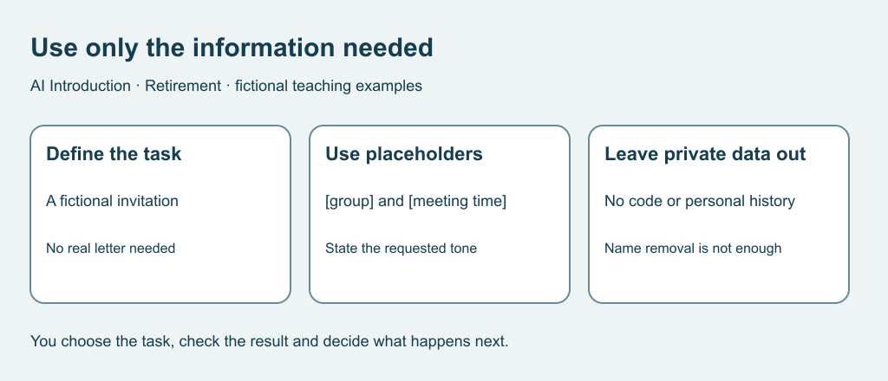

# 6. Choose what to share

[Previous](05-learning.md) · [Course home](../README.md) · [Next](07-messages.md)

## Objective

Remove unnecessary details and respect other people’s choices about their material.

## Explanation

A task can often use invented names and broad context instead of real correspondence. Before using an outside service, consider what it would receive. Actual storage and training practices vary: do not assume every product works the same way.

Removing a name may leave an identifiable event, address or combination of details. Permission to tell a friend a story does not automatically cover uploading or publishing it. Fictional material avoids needing another person's private history.

Text equivalent: Define the task, use fictional details or placeholders, and leave out unnecessary private material.

## Worked example

Fictional note: Alex lives at [exact address] and has [private appointment]. Turn their unpublished letter into a funny public post.

Better brief: Draft an original fictional story about a made-up group arranging a meeting. Use no real letter, address, health information or identifiable event. This changes the task instead of assuming another person's material is available.

## Practice

For a fictional invitation template, choose necessary items:

A. Made-up group name.

B. Real access code.

C. Placeholder [meeting time].

D. A friend's unpublished letter.

E. Warm, brief tone.

Assess: Removing the author's name means I can safely upload the letter without asking.

## Answers and checking

A, C and E can provide sufficient context. B and D are unnecessary. Name removal does not settle identification, permission or rights in a private letter. Use original fiction instead. A later decision to share material needs its own assessment.

## Try independently

Write a fictional prompt using placeholders. Explain the purpose of every detail and remove anything unnecessary.

[Sources and limits](../SOURCES.md) · [Reuse terms](../LICENSE.md)
