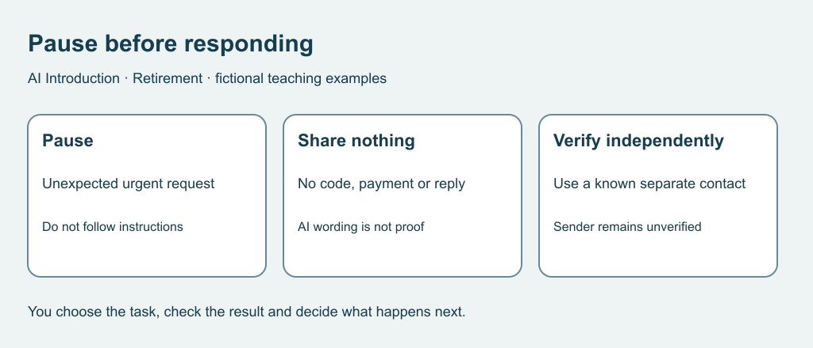

# 7. Pause and verify a suspicious request

[Previous](06-privacy.md) · [Course home](../README.md) · [Next](08-connection.md)

## Objective

Recognize pressure and choose an independent verification route.

## Explanation

An unexpected urgent request for money, access or private details deserves a pause. Polished wording or a familiar-looking name does not establish authenticity. AI cannot certify the sender from the wording alone.

For an unexpected claimed service problem, end that interaction and contact the organization through a separately known or located official route. Do not rely on the message's own contact details. See the Canadian Anti-Fraud Centre's [service-fraud guidance](https://antifraudcentre.ca/scams-fraudes/service-eng.htm).

Text equivalent: Pause, share nothing, then verify through a known independent route.

## Worked example

Fictional message, with no active number or link: Your sketch-club account closes in ten minutes. Send your access code, tell nobody and contact only the number in this message.

Pressure, secrecy and a code request are warning signs. Stop, share no code, and independently check whether a club account or problem exists. You need not establish who sent it before declining.

## Practice

Which route fits, and why?

A. Reply asking the sender to prove identity.

B. Ask AI to label it safe, then comply.

C. Use the club contact previously verified and kept separately.

D. Click its link to see whether the page looks official.

What remains unknown? No real contact or action is required.

## Answers and checking

C uses an independent route. A and D continue through the untrusted message. B treats generated judgment as proof. Sender identity, account status and whether a real problem exists remain unknown. Warning signs justify pausing, not a claim to know the sender. If information was already shared in real life, seek help promptly through the affected service's independently verified channel.

## Try independently

Write three offline steps: pause, share nothing or take no action, verify independently. Describe where a fictional person keeps a verified contact without recording a real number.

[Sources and limits](../SOURCES.md) · [Reuse terms](../LICENSE.md)
