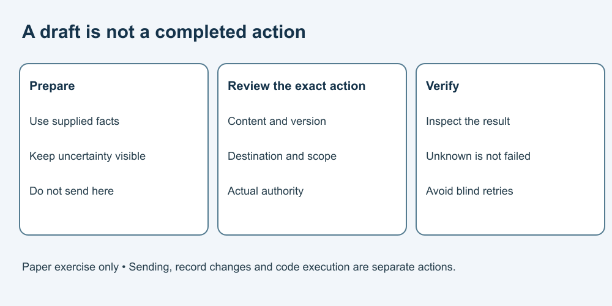

# How to Use AI at Work

**Learn to use AI well—and remain able to think, choose and act for yourself.**

A complete course for adult workplace beginners. Practise useful assistance within your responsibilities, permissions and review processes. No particular occupation, employer rule or AI-service eligibility is assumed. No AI account, installation or paid tool is required.

All activities use fictional notes, messages, policies and workload data. Complete them on paper or in a local editor. No real customer or employee information, live system, sending or code execution is needed.

## Start learning

1. [Choose a bounded task](lessons/01-task.md)
2. [Check workplace permission](lessons/02-permission.md)
3. [Choose inputs that belong in the task](lessons/03-inputs.md)
4. [Give context without granting extra authority](lessons/04-instructions.md)
5. [Check a summary against its source](lessons/05-summary.md)
6. [Draft communication without making promises](lessons/06-message.md)
7. [Verify numbers and prioritisation](lessons/07-table.md)
8. [Separate a draft from an action](lessons/08-actions.md)
9. [Make an accountable handoff](lessons/09-handoff.md)
10. [Build a repeatable workflow](lessons/10-future.md)

Each lesson includes a worked example, practice, answer reasoning and transfer task. Try the exercise before reading the answers. Allow about 20–35 minutes per lesson as a flexible planning suggestion, not a tested duration.

Text equivalent: keep preparation separate from real actions; review exact content and destination, follow actual authority, and inspect the result before reporting success.

## What you will practise

Define a bounded task, choose suitable inputs, check a summary against its source, avoid invented promises, verify a workload table and write an honest handoff. The final lesson compares total effort in fictional timing examples and explores conditional three/five-year scenarios.

## Guides

- [Curriculum](CURRICULUM.md)
- [Facilitator and learner-support guide](FACILITATOR-GUIDE.md)
- [Glossary](GLOSSARY.md)
- [Developer guide](DEVELOPER-GUIDE.md)
- [Sources and limits](SOURCES.md)
- [Pictures and text equivalents](ASSET-SOURCES.md)
- [Free reuse terms](LICENSE.md)

## Boundaries

Use actual workplace rules for real work. This course grants no access, data-transfer or action permission. Never fabricate evidence, impersonate others, hide material uncertainty or bypass authority. Do not use these exercises to rank employees or make hiring, dismissal or other consequential decisions about people.

AI is optional. A manual method or ordinary tool may suit the task. General education only: no professional qualification, legal advice, security certification or guaranteed job, promotion or productivity gain. No workplace learner trial or formal accessibility assessment has been conducted.

Static course files do not implement tracking or submissions. GitHub and other hosts have their own practices; this does not mean a host collects nothing.

## Reuse terms — all educational content — free

Original course material is offered under [CC BY 4.0](LICENSE.md), to the extent the publisher holds the rights. Free sharing, adaptation and commercial reuse are permitted with required credit and notices. External references retain their own terms.

Suggested credit: “AI Introduction — Work — Massoud Fattahi, Canada. CC BY 4.0.” Include source and licence links and identify changes.
