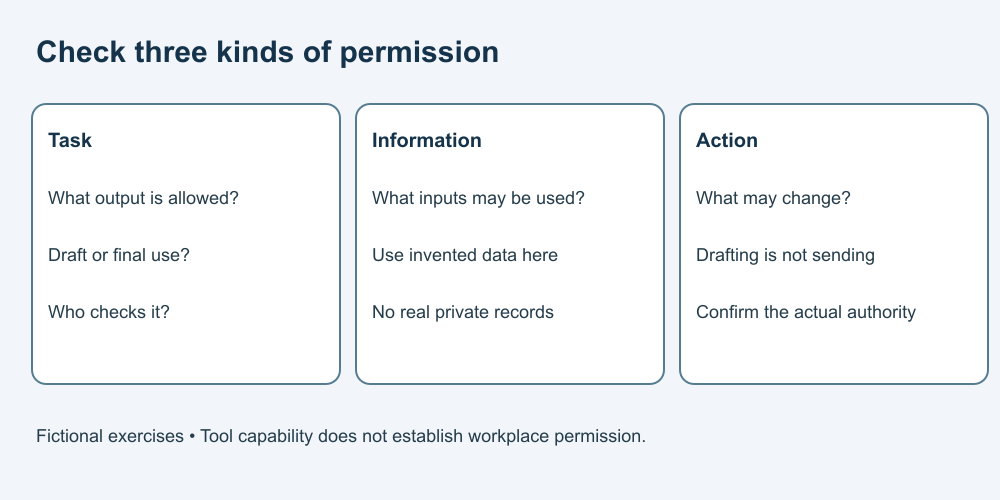

# 2. Check workplace permission

[Course home](../README.md) · [Curriculum](../CURRICULUM.md)

## Objective

Separate approved use from technical capability.

## Explanation

A tool being available does not establish that your employer permits a particular task or dataset. Check the actual rules and responsible contact. Our invented policy cards below are exercises, not any employer's policy or a universal legal rule.

Also distinguish permission from accuracy: an allowed draft can still be wrong. A manager's general encouragement to explore tools need not authorize sending customer data to an unconfirmed service.

## Worked example

Fictional cards:
- A: An approved tool may draft internal summaries from the supplied fictional packet; a person reviews before use.
- B: No external AI service may receive customer records.
- C: “Automation is encouraged”; no action permissions are specified.

A permits the specified draft. B prohibits the stated transfer under that card. C requires clarification before acting.

## Practice

Classify these requests: A/draft the packet; B/upload a customer export; C/send replies automatically. Then write a clarification question for C without including private information.

## Answer and reasoning

Try the practice before reading this section.

The first fits A with review. The second conflicts with B. The third is unresolved: “Which actions and systems may be automated, and who approves the exact scope before activation?” Do not infer action authority from the word automation.

## Transfer task

A new fictional rule permits editing a local draft but requires approval to change the shared record. Can you update the shared record because your draft passed a spelling check? No. The check concerns spelling; the rule concerns authority. Apply the real workplace rule when outside this course.

[Previous](01-task.md) · [Next](03-inputs.md)
