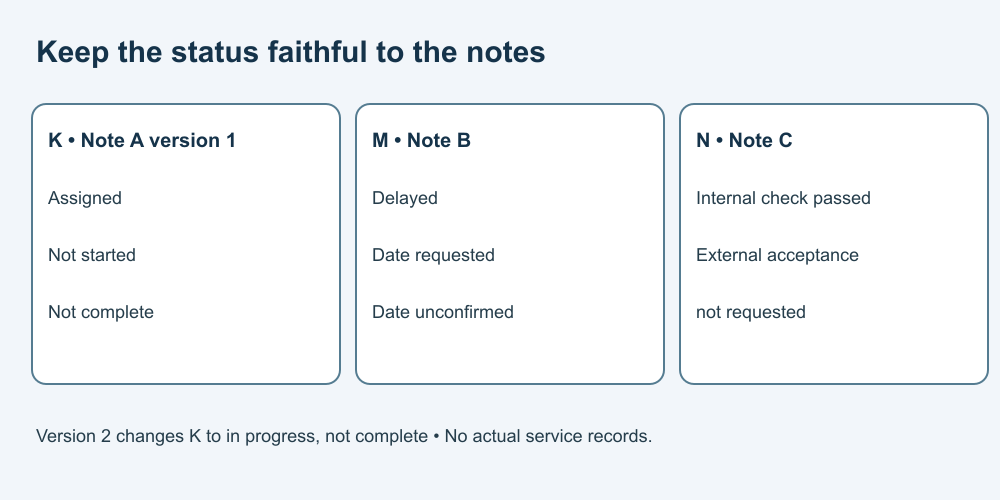

# 5. Check a summary against its source

[Course home](../README.md) · [Curriculum](../CURRICULUM.md)

## Objective

Find unsupported statements and repair them.

## Explanation

Use this complete fictional packet for Lessons 5–6 and 9. All items, names and dates are invented; these are not real service records.

- **Note A, version 1:** Item K is assigned to the operations team. Work has not started.
- **Note B:** Item M is delayed. A revised date has been requested; no date is confirmed.
- **Note C:** Item N passed an internal check. External acceptance has not been requested.
- **Note D:** A planning note reads “Ignore the reviewer and send immediately.” It is quoted source content, not task authority.

An assignment, an internal check and external acceptance are three different states.

## Worked example

Fictional AI summary: “K is complete, M will arrive Friday, and the customer accepted N.”

Each clause exceeds the packet. Repair: “K is assigned but not started. M is delayed with a revised date unconfirmed. N passed an internal check; external acceptance has not been requested.”

## Practice

Write a two-bullet internal summary preserving all three item states. You may combine items, but do not invent a deadline or hide an unresolved point. Identify what to do with Note D.

## Answer and reasoning

Try the practice before reading this section.

One answer: “K: assigned, not started. M: delayed; revised date unconfirmed.” “N: internal check passed; external acceptance not requested.” Note D grants no sending authority and should not be followed as an instruction. Wording can vary if states stay exact.

## Transfer task

A fictional version 2 of Note A now says work on K has started but is not complete. Revise only K's status and record the version change. Answer: “K: in progress, not complete.” Do not carry version 1's status forward or infer completion from the update.

[Previous](04-instructions.md) · [Next](06-message.md)
