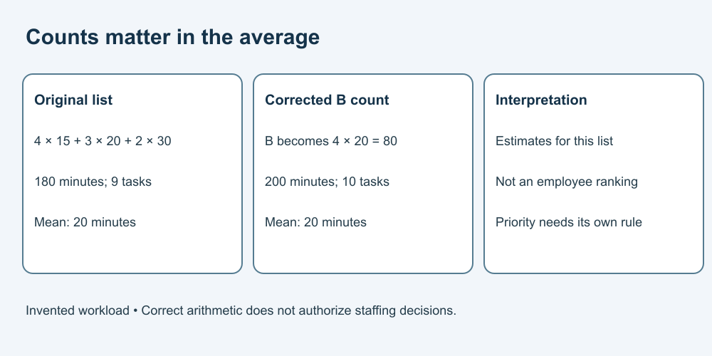

# 7. Verify numbers and prioritisation

[Course home](../README.md) · [Curriculum](../CURRICULUM.md)

## Objective

Check arithmetic separately from the choice of what to do first.

## Explanation

Use this invented workload table, unrelated to real staff performance. Estimate is per task, in minutes. Totals describe this list only; they are not a productivity target.

| Category | Tasks | Minutes per task |
|---|---:|---:|
| A | 4 | 15 |
| B | 3 | 20 |
| C | 2 | 30 |

Arithmetic can check estimated effort. It cannot alone decide priority, fairness or staffing. Ask what criteria and dependencies the task owner actually approved.

## Worked example

A = 60 minutes, B = 60, C = 60. Total = 180 minutes = 3 hours, across 9 tasks. The weighted average estimate is 180/9 = 20 minutes per task. Simply averaging 15, 20 and 30 gives about 21.7, which ignores the unequal task counts.

## Practice

A corrected version changes B's count to 4. Recalculate B, the total, task count and weighted mean. Then apply this fictional priority rule: “Handle the confirmed due-today category first; B is confirmed due today; no other due date is supplied.”

## Answer and reasoning

Try the practice before reading this section.

B becomes 80 minutes; total 200; count 10; weighted mean 20. Under the supplied rule, B comes first because of its confirmed due date, not because a model scored it higher. No ordering of A versus C is established. Do not infer priority from missing dates.

## Transfer task

With zero tasks in every category, the total effort is 0 but the average per task is unavailable. Explain the distinction. Then explain why neither table authorizes ranking employees or making staffing decisions. The entries describe categories of fictional work, not people or their circumstances.

[Previous](06-message.md) · [Next](08-actions.md)
