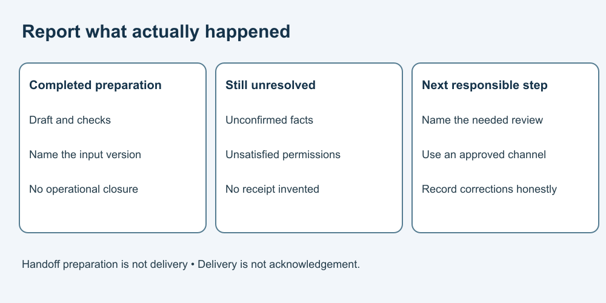

# 9. Make an accountable handoff

[Course home](../README.md) · [Curriculum](../CURRICULUM.md)

## Objective

Report evidence, uncertainty and the next step without pretending receipt.

## Explanation

A useful handoff identifies what was prepared, checked, changed, left unresolved and who is expected to act next. Distinguish a drafted handoff from a sent one, and sending from recipient acknowledgement.

[NIST's AI risk-management guidance](../SOURCES.md) includes defining responsibilities and oversight. Our handoff template is an original practical exercise, not a certification of compliance with that framework.

## Worked example

Fictional handoff:
“Draft summary v2 uses Note A v2 and Notes B–C. K is in progress, not complete; M's date remains unconfirmed; N has internal check only. Arithmetic was checked separately on the corrected workload table. Sending is not authorized by this exercise. Next: designated reviewer confirms recipient and missing update facts.”

This names the state without claiming the recipient accepted it.

## Practice

Repair: “AI finished everything; all issues closed; customer notified.” Use the packet and course activity to identify actual completion, remaining uncertainty and a next responsible action.

## Answer and reasoning

Try the practice before reading this section.

The draft and checks are complete, not the operational issues. M's date and N's external acceptance remain unresolved; K is not complete. No customer was notified. Next is review of the exact proposed communication with needed facts, not an automatic send.

## Transfer task

You receive a corrected input after handing off a draft. Describe a responsible next step without altering history. Record the new version, compare affected statements, and notify through the approved channel if authorized. Do not silently replace evidence or claim that a correction was received merely because you prepared it.

[Previous](08-actions.md) · [Next](10-future.md)
