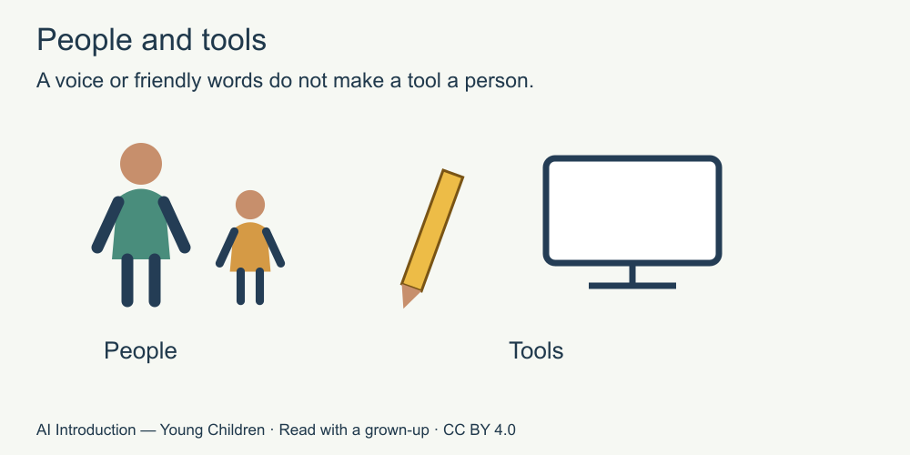

# 1. People and tools

[Course home](../README.md) · [Adult guide](../PARENT-EDUCATOR-GUIDE.md)

**For a grown-up to read with a child.** All stories and answer cards are invented. No AI tool or account is used.

## Our idea

Tell the difference between a person and an AI tool.

## Read together

A tool helps us do something. A pencil helps us draw. Some computer tools use AI. AI is short for artificial intelligence.

An AI tool can make words that sound friendly. It is still a computer tool, not a person. Friendly words do not make it a grown-up who can look after you.

## Little story

Mina draws a kite with a pencil. An adult reads an invented computer answer: “You could draw a kite with stripes.” Mina chooses dots instead.

“The idea is a choice,” says the adult. “You can keep it, change it or leave it.” They put the paper aside and draw together.

## Try together

Point to the person and the tool in the picture. Then say or point: who can Mina ask for help with a worry—a caring adult or the computer tool?

Picture words: people can help care for people. A pencil and a computer are tools.

## For the grown-up

The caring adult is the help choice. The computer can offer words but is not a substitute for care. Do not ask a child to judge whether AI is conscious. This is a practical people/tool distinction; not every computer programme uses AI. Sources S1 and S3. [Source notes for adults](../SOURCES.md).

## Try another way

Imagine a paper picture of a talking toy. Does a voice turn the toy into a person? No. The adult can explain that some toys use recordings, some use AI and some use other programmes. We are not testing a real toy.

[Next: Ideas a tool can offer](02-helpful-ideas.md)

