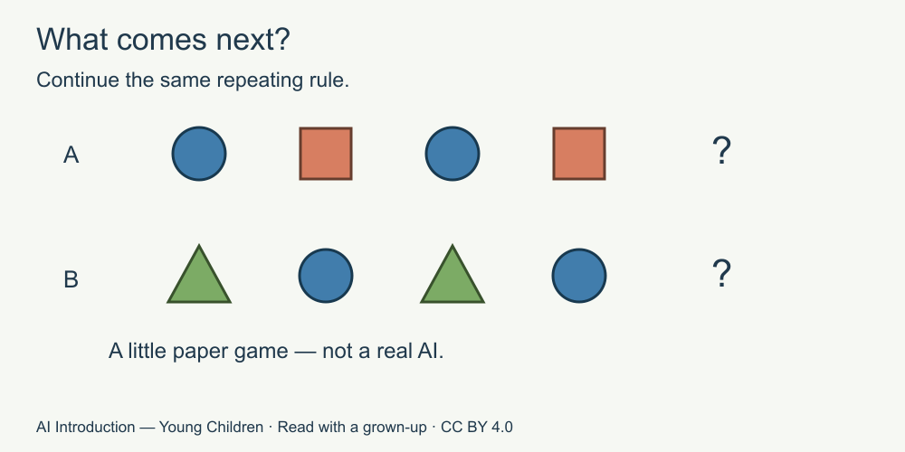

# 3. A little pattern game

[Course home](../README.md) · [Adult guide](../PARENT-EDUCATOR-GUIDE.md)

**For a grown-up to read with a child.** All stories and answer cards are invented. No AI tool or account is used.

## Our idea

Notice that a pattern can suggest a next item without proving it.

## Read together

A pattern is something we notice repeating or fitting together.

Many AI tools are made using lots of examples. Finding patterns is part of how many of them work. Our little paper game is much simpler. It is not a real AI.

## Little story

The adult shows a row: circle, square, circle, square. “If we keep this repeating pattern, what comes next?”

Jo points to a circle. Then the adult says, “That fits our rule. But a person could choose to change the row.”

## Try together

Look at the picture, or listen to the shape names. Put an imaginary circle after the first row if the rule stays the same. For the second row, say the next shape if the triangle-circle rule continues.

Picture words: row A is circle, square, circle, square, question. Row B is triangle, circle, triangle, circle, question.

## For the grown-up

Row A: circle. Row B: triangle, under the stated rules. Shapes rather than colours carry the answer. Finite examples alone can fit many possible rules; the instruction to continue this particular repeat makes the intended answer clear. Do not describe every AI as a simple repeating sequence or claim it always learns during a chat. Source S2. [Source notes for adults](../SOURCES.md).

## Try another way

Changed rule: after the first four shapes, the person chooses a star. Was the circle guaranteed? No. Our answer depended on continuing the rule.

[Next: Tell us what you mean](04-ask-clearly.md)

