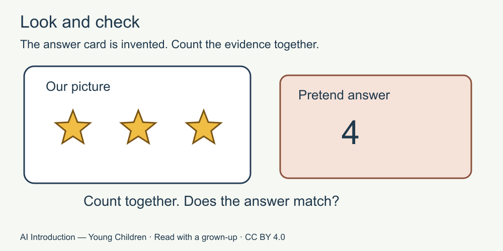

# 5. Look and check

[Course home](../README.md) · [Adult guide](../PARENT-EDUCATOR-GUIDE.md)

**For a grown-up to read with a child.** All stories and answer cards are invented. No AI tool or account is used.

## Our idea

Compare an invented answer with supplied evidence.

## Read together

An AI answer can be wrong, even if it sounds sure.

For our game, we can look at the picture and count together. For other questions, a grown-up can help find a suitable book or other reliable source. Asking the same tool again is not proof.

## Little story

Nia sees a card with three stars. The invented answer card says, “There are four stars.”

Nia and the adult touch each star on the paper as they count: one, two, three. They change the answer to three.

## Try together

Count the stars shown in the picture or use its spoken description. Which answer matches this picture: three or four? What if we add one more star on a new paper card?

Picture words: the evidence card has three stars. The pretend answer says four. We count together.

## For the grown-up

Three matches the supplied card; one more would make four. The incorrect answer is authored fiction, not an output captured from a product. The visible evidence settles only this counting question. Do not turn it into a claim that a young child can detect all AI errors. Source S4 supports the possibility of confidently incorrect output. [Source notes for adults](../SOURCES.md).

## Try another way

Alternative: the adult says the sequence “tap, tap, tap,” slowly, without requiring a child to hear or see it. Use whichever equivalent works for the learner. Check the adult's invented answer together; being wrong is a chance to revise.

[Next: Keep private things private](06-private.md)

