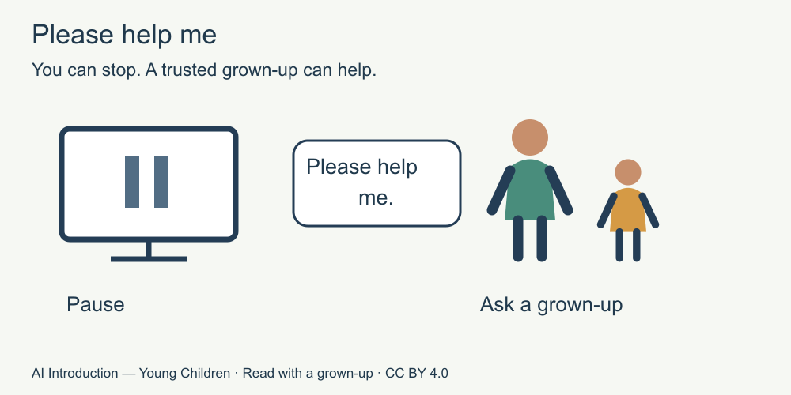

# 8. Stop and ask for help

[Course home](../README.md) · [Adult guide](../PARENT-EDUCATOR-GUIDE.md)

**For a grown-up to read with a child.** All stories and answer cards are invented. No AI tool or account is used.

## Our idea

Practise a simple help request without seeing upsetting material.

## Read together

If something on a screen worries or confuses you, you can stop and tell a trusted grown-up. You do not have to keep talking to a tool.

You can say, “Please help me with this.” You do not have to solve it alone.

If a tool shows something upsetting, it is not your fault.

## Little story

An empty paper screen has a card beside it: “Something confusing happened.” There is no scary message or picture.

The adult models a calm reply: “Thank you for telling me. Let's get help together.” The child may just point to the help card.

## Try together

Choose a response for the fictional character: keep going alone, or pause and ask a trusted grown-up. Practise the words “Please help,” point to the picture, or skip the practice.

Picture words: stop using the confusing thing; a trusted grown-up helps. No upsetting content is shown.

## For the grown-up

Pause and seek help is the intended response. A trusted adult may be a caring parent, carer or teacher; familiarity alone is not proof of safety. If one adult does not help, the child can seek another trusted adult. Adults handle protection and any reporting; do not require children to collect evidence. Sources S5 and S6. [Source notes for adults](../SOURCES.md).

## Try another way

Neutral alternative: a paper puzzle has no instructions. Ask for help with the puzzle. Do not simulate a frightening event. If a real concern is disclosed, stop the lesson and respond supportively using appropriate local help.

[Next: Make it your own](09-make.md)
