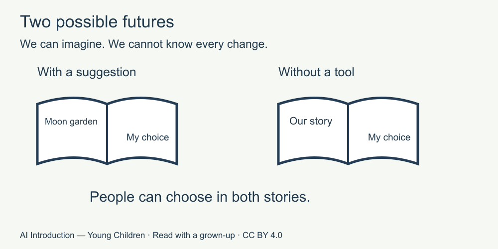

# 10. Imagine tomorrow

[Course home](../README.md) · [Adult guide](../PARENT-EDUCATOR-GUIDE.md)

**For a grown-up to read with a child.** All stories and answer cards are invented. No AI tool or account is used.

## Our idea

Distinguish a possible future from a promise.

## Read together

We can imagine what life might be like in five years. We cannot know every change.

AI tools might help people with some tasks. People will still need to make choices, ask questions and care for one another. These are hopes and ideas, not promises.

## Little story

In one made-up future, a family uses a tool to suggest a picture-book idea. They check it and make their own ending. In another, the tool is not available, so they tell a story together.

Both families can make choices. Neither story tells us what will really happen.

## Try together

Look at the two imagined futures. What can people do in both? Choose one: make choices, or know every future event.

Picture words: one possible future includes a tool suggestion; another does not. People can tell stories in both.

Then try three final cards:

- T1: A pretend answer says four stars, but the picture in Lesson 5 has three. What can we check?
- T2: A request asks for a real home address. Should we put it in our paper story?
- T3: A character feels confused. Who could help?

## For the grown-up

People can make choices in both stories. T1: count the supplied three stars together; revise the answer. T2: no; use a made-up setting without recording personal data. T3: a trusted grown-up, not continued solo interaction with a tool. These are discussion prompts, not a test score or guarantee of independent safe use. [Source notes for adults](../SOURCES.md).

## Try another way

Finish with one choice: make a story, ask a question, play without a tool, or take a break. The adult may note which distinction to revisit without naming, ranking or recording a child's private experience.

[Return to course home](../README.md)
